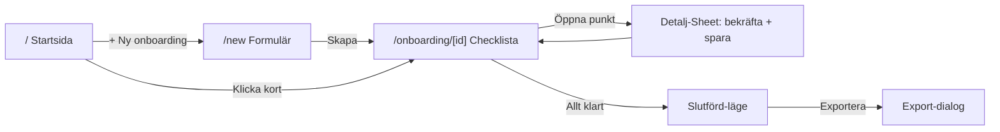

# Onboarding App v1

## Beslut (bekräftade)
- Export: PDF (via webbläsarens utskrift), Skriv ut, Kopiera och Ladda ner fungerar på riktigt. E-post = `mailto:`. Word + OneDrive = snygga UI-stubbar (toast "kommer snart").
- Checklistans 11 punkter fylls med realistisk men generisk platshållartext, lätt att redigera senare.
- Ingen backend/auth. State persistas i `localStorage`.

## Teknik & arkitektur
- **Next.js 16 App Router** (Turbopack default). Sidor som läser/skriver data blir Client Components (`"use client"`) och läser route-param via `useParams()` — undviker den nya async-`params`-regeln. Rotlayouten förblir Server Component.
- **State**: `zustand` med `persist`-middleware mot `localStorage`. En `OnboardingStore` håller alla onboardingar + CRUD + härledd progress.
- **UI**: shadcn/ui (Button, Card, Dialog, Sheet, Input, Label, Textarea, Checkbox, Progress, Badge, Separator) + `lucide-react` + `sonner` (toasts). Lätt användning av `motion` (framer-motion) för fade/scale på kort och vyer.
- **Designtokens** i [app/globals.css](app/globals.css): vit bakgrund, indigo/violet accent (`#7C3AED`/`#8B5CF6`/`#6366F1`), statusfärger grön/orange/röd, radius 16–24px, mjuka skuggor, mycket whitespace. Behåller Geist-fonten.

## Routes (riktig struktur, inte allt på en sida)
- `/` — Startsida: rubrik "Onboarding", "Vad vill du göra idag?", primärknapp "+ Ny onboarding", sektioner Pågående / Slutförda som kort.
- `/new` — Formulär: Förnamn, Efternamn, Startdatum, Befattning, Ansvarig chef → "Skapa onboarding" (skapar med standard-checklista, navigerar till detaljen).
- `/onboarding/[id]` — Checklistvy: progress-header överst (progressbar, %, "X av Y klara"), lista med punkter. Klick öppnar detalj i en **Sheet** (slide-over). När allt är bekräftat visas slutförd-läget (grön checkmark + "Exportera").

## Datamodell ([lib/types.ts](lib/types.ts))
- `Onboarding`: id, firstName, lastName, startDate, position, manager, createdAt, items: `ChecklistItem[]`.
- `ChecklistItem`: id, title, description, info, documents, comment, confirmed.
- Status härleds: 0% = "Ej påbörjad", 1–99% = "Pågående", 100% = "Slutförd".

## Komponenter ([components/](components/))
- `ui/*` — shadcn-primitiver.
- `onboarding/OnboardingCard.tsx` — namn, befattning, progressbar, %, status-badge.
- `onboarding/ProgressHeader.tsx` — progressbar + % + antal klara.
- `onboarding/NewOnboardingForm.tsx` — formuläret.
- `onboarding/ChecklistItemRow.tsx` — rad med checkbox + öppna-knapp.
- `onboarding/ChecklistItemDetail.tsx` — Sheet: rubrik, beskrivning, informationsruta, dokument, kommentar, "Bekräfta genomgång", Spara.
- `onboarding/CompletionState.tsx` — grön checkmark, "Onboarding slutförd", Exportera-knapp.
- `onboarding/ExportDialog.tsx` — exportalternativ + "Vad ska inkluderas?"-kryssrutor + Exportera.

## Lib ([lib/](lib/))
- `store.ts` — zustand-store (persist).
- `checklist-template.ts` — de 11 standardpunkterna med platshållartext.
- `export.ts` — bygg exporttext utifrån valda sektioner; copy/download/print/mailto.
- `utils.ts` — `cn`-helper.

## Flöde

## Risker
- shadcn/ui-init på Tailwind v4 + Next 16/React 19 kräver senaste CLI; verifieras direkt efter init. Om problem uppstår byggs motsvarande lättviktskomponenter för hand i samma stil.